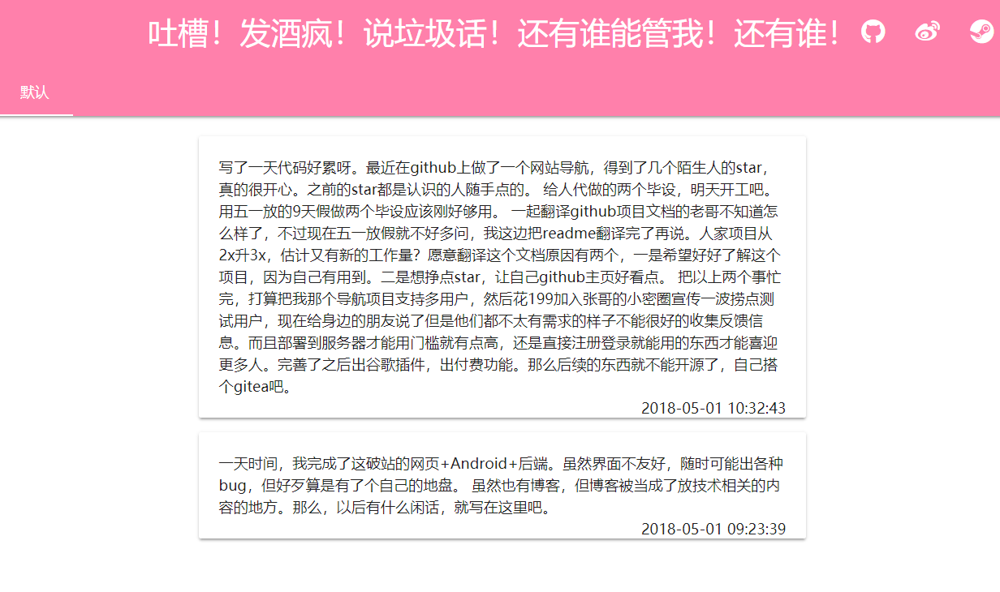

# whisper

我用来发布动态的工具，很粗糙的小东西，一天就做完了，偏向于自用

网页端仅用于显示内容，手机端用于发布修改和删除内容，目前仅支持纯文本。虽然已经有博客了，可是我的博客只用于写技术相关的东西，而且现在能用手机直接编辑博客内容的自搭建平台根本没有好伐。而且我不喜欢QQ空间，py圈，微博这些第三方平台的气氛

## 效果截图|[演示站](http://valorachen.club/whisper/)




## 食用方法（真的会有人用？感觉是我自作多情）
下载[whisper.zip](https://github.com/ChenViVi/whisper/releases/download/0.0.1/whisper.zip)到你的网站目录并解压，新建数据库并导入`whisper.sql`，然后在`config.php`中配置数据库和ip白名单（填入你手机的ip），例如：

```
wget https://github.com/ChenViVi/whisper/releases/download/0.0.1/whisper.zip

unzip whisper.zip

cd whisper.zip

mysql -uroot -p

create database whisper;

use whisper;

set names utf8;

source whisper.sql;

quit

vim config.php

source portal.sql;
```

下载[whisper.apk](https://github.com/ChenViVi/whisper/releases/download/0.0.1/whisper.apk)安装到手机，在设置界面中输入`http://你的ip或者域名/whisper`并点击fab，就配置成功了。如果出现`网络连接失败`的提示，那绝逼是你的手机不在ip白名单内，用手机访问[http://你的ip或者域名/whisper/request/type_get.php](http://你的ip或者域名/whisper/request/type_get.php)，返回json中data的值就是你手机的ip，在`config.php`中的$IP_WHITE_LIST中添加上去就可以了

## 想法
最初这个项目的灵感来源于我自己的需求：我想要一个支持手机端编辑的博客。不知道这个想法会不会人所喜爱。现在自搭建的博客平台，有wordpress那种操作数据库的，也有生成静态页面的，可是没有一个支持手机端编辑的工具。想随时随地写点什么想法，而不是一篇长篇大论的博客，这种自搭建的平台还真的没有。可是这种东西需求量大么？我倒是真的可以像模像样的做一个web+android双端，或者基于wordpress的某一个主题做一个android端，可是我不做。第一，我以我现在的需求现在这个一天做完的垃圾玩意已经够我用了；第二，我是真的忙；第三，我还感受不到这方面的需求量究竟多不多。如果你有任何看法，欢迎issue
